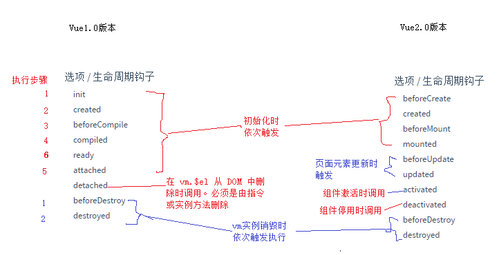

# Vue

## MVVM模式

 -  MVVM拆分解释为 :

    - Model : 负责数据存储
    - View : 负责页面展示
    - view Model : 负责业务逻辑处理  对数据加工后 交给识图展示 

- MVVM要解决的问题是将业务逻辑代码与视图代码进行完全分离 使各自的职责更加清晰,后期维护更加简单

- Vue中的MVVM

  

  ​

## Vue常用指令

- 插值表达式 {{ }} 

- 数据绑定的最常见形式就是使用"Mustache"语法 (双大括号语法) 的文本插值

    `<p>Message:{{ msg }}</p>`

   msg的属性无论何时改变 插值的内容都会更新 

  	支持简单的表达式

  ​	{{number+1}}

  ​	{{1?true:false}}

  以下表达式无效

  ​	{{ var num = 1 }}

  ​	{{ if(true){ return 1 } }}

- v-text

  v-text可以讲一个变量的值渲染到指定元素中 

  ​	`<div v-text="msg"></div>`

- v-html

  与v-text类似 会把值渲染成html代码

- v-cloak

  v-cloak指令保持在元素上 直到关联实例结束编译后自动移除  使用时必须和css规则一起使用 : [v-cloak]{display:none} 一起用时可以隐藏未被编译的插值表达式 直到实例准备完毕 

  通常用来防止{{}}表达式闪烁问题

  ​	`<p v-cloak>{{msg}}</p>`

- v-model以及双向数据绑定

  v-model仅支持有value属性的元素 

- v-bind

  作用 可以给html元素动态绑定一个或多个特性

  `<p v-bind:class="{red:true}" ></p>`

  缩写形式:

  `<p :class="[classA,classB]"></p>`

- v-for

  作用 : 通常是根据数组中的元素遍历指定模板内容生成内容

  ````javascript
  //用法
  <ul>
  	<li v-for="item in datas">{{item.text}}</li>	 
  </ul>
  new Vue({
    data:{
    	datas:[{text:"1"},{text:"2"}]
    }
  })    
  //可以指定数组索引或者用于对象的键
  //vue 1.0写法
  <ul>
  	<li v-for="(index,item) in datas">{{index}}--{{item.text}}</li>	 //0--1
      															//1--2
  </ul>
   <ul>
     <li v-for="(key,val) in obj">{{key}}--{{val}}</li>//name--dog
  													age--18		   
   </ul>   
  new Vue({
    data:{
    	datas:[{text:"1"},{text:"2"}],
      obj:{name:"dog",age:18}
    }
  })    
  //vue 2.0 index和item是反过来的 并且在遍历对象时可以使用index
  //v-for默认不改变整体而是替换元素迫使其重新排列的元素需要在指令后面加track-by="$index" 在2.0中需要绑定一个key属性 :key="item.id"或者index
  ````

  vue1.0与2.0 v-for使用区别 :

  ​	1.0中有$index 2.0移除

  ​	1.0中(index,item) in list 2.0变为(item,index) in list

  ​	1.0中使用trackBy标记dom唯一性 2.0中改为 :key

- v-if

  作用 :根据表达式的真假条件来决定是否渲染元素 为false时将元素从dom中移除 为true时渲染 在切换时元素及他的数据绑定被销毁并重建

  `<p v-if:true>一行代码</p>`

  也可以

  ```html
  <!-- Handlebars 模板 -->
        {{#if isShow}}
          <h1>Yes</h1>
        {{/if}}
  ```

  或者使用v-else

  ```html
  <h1 v-if="isShow">Yes</h1>
     <h1 v-else>No</h1>
     <!--v-else必须跟在v-if元素后面-->
  ```

- v-show

  根据表达式的真假切换元素的display属性,为false为元素添加 display:none 隐藏元素

  `<p v-if:true>一行代码</p>`

- v-on

  作用 : 绑定事件监听,表达式可以是一个方法名字或者内联语句 如果没有修饰符可以省略 在html元素上只能监听DOM事件,在自定义组件上可以监听子组件触发的自定义事件

  常用事件:

      	v-on:click
          v-on:keydown
          v-on:keyup
          v-on:mousedown
          v-on:mouseover
          v-on:submit
  修饰符 : 

        .stop - 调用 event.stopPropagation()。
        .prevent - 调用 event.preventDefault()。
        .capture - 添加事件侦听器时使用 capture 模式。
        .self - 只当事件是从侦听器绑定的元素本身触发时才触发回调。
        .{keyCode | keyAlias} - 只当事件是从侦听器绑定的元素本身触发时才触发回调。
        .native - 监听组件根元素的原生事件。
  方法处理器

  `<button v-on:click="click"></button>`

  内联语句

  `<button v-on:click="click('hello')"></button>`

  缩写

  `<button @click="click"></button>`

  ### v-on按键修饰符

  在监听键盘事件时，我们经常需要监测常见的键值。 Vue 允许为 v-on 在监听键盘事件时添加按键修饰符：

      .enter
      .tab
      .delete (捕获 “删除” 和 “退格” 键)
      .esc
      .space
      .up
      .down
      .left
      .right
      1.0.8+ 支持单字母按键别名。
  ​	`<input type="text" @keydown.enter="submit()"></input>`

- 自定义按键名

  vue2.0默认的按键修饰符是储存在Vue.config.keyCodes中

  // 在Vue2.0中扩展一个按键修饰符的写法

  `Vue.config.keyCodes.f1 = 112`

  vue1.0.17的默认按键修饰符在Vue.directive('on').keyCodes中

   // 例如在Vue1.0中扩展一个f1的按键修饰符写法：
   `Vue.directive('on').keyCodes.f1 = 112`
  ​    

## 自定义指令

- 写法:

  ````javascript
  Vue.directive("指令id",function(){//使用时不需要加v-
    //实现的操作
    //this.el表示调用这个指令的元素对象
    //this.vm表示这个指令所在控制器
  })
  ````

  `<p v-指令id> </p>`

## 过滤器

vue提供了一系列的固定逻辑使人更易实现这些功能 这些过滤器称为系统过滤器 vue也提供了一个借口来定义属于自己的特殊逻辑 称为自定义过滤器

### 系统过滤器

​	vue1.0有2.0已移除 过滤器接口文档: <https://v1-cn.vuejs.org/api/#过滤器>

	### 自定义过滤器

​	文档地址：http://v1-cn.vuejs.org/guide/custom-filter.html

 -  自定义私有过滤器

    ````javascript
    new Vue({
      el:"body",
      data:{
        
      },
      filters:{
        "过滤器名字":function(|左边的值,"参数1" ,"参数2"){
          return 对|左面的值的处理后的值
        }
      }
    })

    ````

    vue 1.0使用写法

    `<span >{{msg|过滤器id "参数1" "参数2"}}</span>`

    vue 2.0使用写法

    `<span >{{msg|过滤器id ("参数1" "参数2")}}</span>`

-  全局过滤器

    可以用Vue.filter（）注册一个自定义全局过滤器 他接收两个参数 过滤器id和过滤函数 过滤器函数以值为参数 返回转换后的值

    ````
    //定义格式
    Vue.filter('过滤器名称',function(|左边的值,其他参数1,其他参数2){
      return 对|的参数处理后的值
    })
    ````

    使用方式与私有过滤器一样

## Vue中的AJAX请求

vue可以借助vue-resource来实现AJAX请求

- http请求报文

      浏览器与服务器数据交互是遵循http协议的，当浏览器要访问服务器的时候，浏览器需要将相关请求数据提交给服务器（例如：浏览器信息，url地址，参数等），通常是通过请求报文来提交的
      请求报文的格式分为：
          1、请求报文行
          2、请求报文头
          3、请求报文体

- http响应报文

  ````
    当浏览器请求服务器的时候，服务器需要将数据返回给浏览器，这种数据是通过响应报文响应回浏览器的
      
       响应报文的格式分为：
          1、响应报文行
          2、响应报文头
          3、响应报文体
  ````

  ### vue-resource

   vue与后台api进行交互通常是利用vue-resource来实现的 本质上是vue-resource是通过http来完成AJAX请求响应的

- vue-resource GitHub 地址：https://github.com/pagekit/vue-resource

- vue-resource Http请求api参考（主要看这个）：https://github.com/pagekit/vue-resource/blob/master/docs/http.md

- vue结合vue-resource写法

  1. 通过https://cdn.jsdelivr.net/vue.resource/1.2.1/vue-resource.min.js 下载vue-resource文件

  2. 导入vue-resource.js文件后就会自动在Vue对象中实例化$http

  3. 使用

     ````JavaScript
     //全局Vue对象写法
     	Vue.$http.get(url,[options]).then(successCallback,errorCallback);
     	Vue.$http.post(url,[body],[options]).then(successCallback,errorCallback);
     	// 在Vue对象中的写法
             this.$http.get('/someUrl', [options]).then(successCallback, errorCallback);
             this.$http.post('/someUrl', [body], [options]).then(successCallback, errorCallback);
     ````

     - vue-resource get请求

       写法:

       this.$http.get("请求的url",[可选参数对象使用{}]).then(成功回调函数,失败回调)

     - vue-resource post请求

       写法:

       this.$http.get("请求的url",[可选参数对象使用{}]).then(成功回调函数,失败回调)

       $http.post()方法中的第二个参数固定写成：{emulateJSON:true},否则可能造成服务器无法接收到请求报文体中的参数值

     -  vue-resource jsonp请求

       写法:

       this.$http.get("请求的url",[可选参数对象使用{}]).then(成功回调函数,失败回调)

## 生命周期方法



## Vue过渡动画

- 通过vue.js的过滤系统,可以在元素插入或移除时自动应用过渡效果 Vue.js会在适当时机为你触发css过渡或动画

  常用场景 :

  1. 条件渲染(v-if)
  2. 条件展示(v-show)
  3. 动态组件

### transition的作用

- vue1.0中为了应用过渡效果 需要在实现过渡动画的元素上使用transition特性

  `<div v-if="show" transition="my-transition"></div>`

- 在vue2.0中改变了写法`<transition><p v-show="isShow">一行代码</p></transition>`

### 过渡动画的几种写法

- css控制过渡动画

  - vue1.0写法 

    ````css
    	<style type="text/css">
    		.show-transition{
    			transition : all 2s ease;
    			padding-left: 0;
    		}
    		.show-enter,.show-leave{
    			padding-left: 100px;
              
    		}
    	</style>
    ````

    ````html
    	<div id="app">
    		<button @click="toggle">按钮</button>
    		<div v-show="isshow" transition="show">
    			一行代码
    		</div>
    	</div>
    ````

    ````javascript
    <script type="text/javascript">
    	new Vue({
    		el:"#app",
    		data:{
    			isshow:false
    		},
    		methods:{
    			toggle:function(){
    				this.isshow=!this.isshow;
    				console.log(this.isshow)
    			}
    		}
    	})
    </script>
    ````

  - vue2.0写法

    ````css
    <style>
    		/*
    	  因为.show-enter-active,.show-leave-active在整个动画过程中都是存在于元素上面的，所以
    	  transition:all 1s ease;必须写在这个上面才能持续作用于元素，才能产生动画效果
    	 */
    	.show-enter-active,.show-leave-active{
    		transition:all 1s ease;
    	}

    	/*
    	.show-enter：标记动画开始的位置为padding-left: 100px;
    	.show-leave-to:标记动画离开的结束位置为padding-left: 100px

    	 */
    	.show-enter,.show-leave-to{
    		padding-left: 100px;
    	}

    	/*
    	.show-leave:标记动画离开时的初始位置为：padding-left: 10px;;
    	.show-enter-to：标记动画开始的结束位置为：padding-left: 10px;;

    	 */
    	.show-enter-to,.show-leave{
    			padding-left: 10px;
    		}

    </style>
    ````

    ````html
    	<div id="app">
     	<button @click="toggle">隐藏和显示</button> <br>
     	<!-- 加上动画步骤1.0 利用<transition>元素包括住需要实现过渡动画的元素  -->
     	<transition name="show">
     		<span v-show="isshow">{{msg}}</span>
     	</transition>

    	</div>
    </body>
    ````

    ````javascript
    <script>
    	new Vue({
    		el:'#app',
    		data:{
    			isshow :false,
    			msg:'hello vuejs'
    		},
    		methods:{
    			toggle :function(){
    				this.isshow = !this.isshow;
    			}
    		}
    	});
    </script>
    ````

- 利用animate.css控制过渡动画

  - vue1.0写法

    ````html
    <body>
    	<div id="app">
     	<button @click="toggle">隐藏和显示</button> <br>
     	<transition 
     	 >
         <!-- 只能对块级元素适用 transition标记这是要实现过渡动画的元素后面的名字要自定义 --> 
     	<div class="animated" transition="show"  v-show="isshow">{{msg}}</div>
    	</transition>
    </body>

    ````

    ````javascript
    <script>
    new Vue({
    	el:'#app',
    	data:{
    		isshow :false,
    		msg:'hello vuejs'
    	},
    	methods:{
    		toggle :function(){
    			this.isshow = !this.isshow;
    		}
    	},
      transition:{
        //名字要和transition中的值一致
        'show':{
          //进入和离开的动画方式选择animate.css中的对应动画类
        	enterClass="fadeInRight",
         	leaveClass="fadeOutRight"
        }
      }
    });
    </script>

    ````

  - vue2.0的写法

    ````html
    <body>
    	<div id="app">
     	<button @click="toggle">隐藏和显示</button> <br>
     	<transition 
     	 enter-active-class="animated fadeInRight"
         leave-active-class="animated fadeOutRight">
     		<div style="width:100px" v-show="isshow">{{msg}}</div>
    	</transition>
    </body>

    ````

    ````JavaScript
    <script>
    new Vue({
    	el:'#app',
    	data:{
    		isshow :false,
    		msg:'hello vuejs'
    	},
    	methods:{
    		toggle :function(){
    			this.isshow = !this.isshow;
    		}
    	}
    });
    </script>

    ````

- 利用钩子函数控制过渡动画

  - vue1.0钩子函数

    1. 过渡动画进入

          beforeEnter:function(el){}      过渡动画进入之前，一般在这个方法中定义目标元素的初始位置
          enter:function(el,done){}       过渡动画进入中，在这个方法中定义目标元素的结束位置
          afterEnter:function(el){}       过渡动画结束后，通常在这个方法里面重置初始值
          enterCancelled:function(el){}   取消过渡动画时被调用

    2. 过渡动画离开

          beforeLeave:function(el){}      动画离开之前触发    
          leave:function(el){}            过渡动画进入中触发
          afterLeave:function(el){}       过渡动画离开结束后
          leaveCancelled:function(el){}   取消过渡动画时被调用

  - vue2.0钩子函数

    1. 过渡动画进入

       ````
       before-enter     过渡动画进入之前一般用这个方法定义元素的初始位置
       enter            过渡动画进入中,在这个方法中定义目标元素的结束位置
       after-enter      过渡动画结束后,通常在这个方法中重置初始值
       enter-cancelled   取消过渡动画时被调用
       ````

    2. 过渡动画离开

       ````
       before-leave       动画离开之前触发
       leave              动画进入中触发
       after-leave        过渡动画离开结束后
       leava-vancelled    取消过渡动画时被调用
       ````

       示例

       ````css
       	<style type="text/css">
       		/*给要执行动画的元素加上过渡动画 很重要*/
       		.show{
       			transition:all 0.5s ease;
       		}
       	</style>

       ````

       ````html
       <body>
       	<div id="app">
       		<button @click="isShow()">按钮</button>
       		<transition @before-enter="beforeEnter" @enter="Enter" @after-enter="afterEnter">
       		<!-- 把要进行动画的元素包裹在transition标签中 并且给transition注册事件  -->
       			<p style="width: 100px" v-show="isshow" class="show">{{text}}</p>
       		</transition>
       	</div>
       </body>

       ````

       ````javascript
       <script type="text/javascript">
       	new Vue({
       		el:"#app",
       		data:{
       			text:"一行代码",
       			isshow:false
       		},
       		methods:{
       			isShow:function(){
       				this.isshow=!this.isshow
       			},
       			//这个方法在动画进入时触发 可以设置元素的初始位置
       			//el表示执行动画的元素
       			beforeEnter:function(el){
       				el.style.transform="translate(100px,0)"
       			},
       			//动画执行过程中
       			Enter:function(el,done){
       				//设定当前动画的每一帧刷新
       				el.offsetWidth
       				//设定结束位置
       				el.style.transform="translate(10px,0)"
       				//手动调用方法
       				done()
       			},
       			//动画结束后将isshow的值初始化为false来隐藏元素
       			afterEnter:function(){
       				this.isshow=!this.isshow
       			}
       		}
       	})
       </script>
       ````

       ​

## Vue组件

### 组件的定义和注册

1.  使用Vue.extend方法定义组件, 使用Vue.component方法注册组件

   ````html
   	<div id="app">
   		<!--这里的标签名要和下面一样-->
   		<dog></dog>
   	</div>
   ````

   ````javascript
   	//定义组件
   	var account=Vue.extend({
   		template:"<p>另一行代码</p>"
   	})
   	//全局注册组件
   	Vue.component('dog',account)
       new Vue({
       	el:"#app"
       })
   ````

2.  使用Vue.component定义注册组件

   ```html
   	<div id="app">
   		<account></account>
   	</div>
   ```

   ````javascript
   	
   	Vue.component('account',{
   		template:"<div>一行代码</div>"
   	})
   	
       new Vue({
       	el:"#app"
       })
   ````

3.  将组件内容定义到template模板中

   ````html
   	<template id="account">
   		<p>还是一行代码</p>
   	</template>
   	<div id="app">
   		<temp></temp>
   	</div>
   ````

   ````javascript
   	Vue.component('temp',{
   		//这里的id要和上面template的id一样
   		template:"#account1"
   	})
       new Vue({
       	el:"#app"
       })
   ````

4.  将组件内容定义到属性为x-template的script标签中

   ````html
   <script type="x-template" id="account">
   		<p>还是一行代码</p>
   	</script>
   	<div id="app">
   		<temp></temp>
   	</div>
   ````

   ````javascript
   Vue.component('temp',{
   		//这里的id要和上面template的id一样
   		template:"#account1"
   	})
       new Vue({
       	el:"#app"
       })
   ````

### 组件实现指令以及事件绑定

````html
	<!-- 定义模板 -->
	<template id="account">
	<!-- vue2.0中模板内容需要有一个根节点包裹 -->
		<div>
			<button @click="info">按钮</button>
			<p>{{msg}}</p>
		</div>
	</template>
	<div id="app">
		<temp></temp>
	</div>

````

````javascript
	Vue.component("temp",{
		template:"#account",
		//组件中的data是一个方法 里面要return一个对象
		data:function(){
			return{
				msg:"一行信息"
			}
			
		},
		methods:{
			info:function(){
				alert(this.msg)
			}
		}
	})
	new Vue({
		el:"#app"
	})
````

### 组件中注册子组件

````html
	<template id="account">
	<!-- 子组件只能在父组件模板里使用 -->
		<son></son>
	</template>
	<div id="app">
		<temp></temp>
	</div>
````

````javascript
	Vue.component("temp",{
		template:"#account",
		//组件中的data是一个方法 里面要return一个对象
		components:{//在组件对象中的一个属性 后面要加s
			//这里的名字要和上面一样
			"son":{
				template:"<p>子组件</p>"
			}
		}
	})
	new Vue({
		el:"#app"
	})

````

### 组件中利用component的is来实现子组件切换

````html
	<template id="account">
		<div>
			<a href="#" @click="componentName='son1'">按钮1</a>
			<a href="#" @click="componentName='son2'">按钮2</a>
			<component :is="componentName"></component>	
          <!--这个标签只能在模板中用-->
          <!--这里 is后面的值为什么就调用哪个组件-->
		</div>
	</template>
	<div id="app">
		<temp></temp>	
	</div>	

````

````javascript
Vue.component("temp",{
	template:"#account",
	data:function(){
		return {
			componentName:"son1"
		}
	},
	components:{
		"son1":{
			template:"<p>代码一</p>"
		},
		"son2":{
			template:"<p>代码二</p>"
		}
	}
})
new Vue({
	el:"#app"
})
````

### 实现父组件传值给子组件

```html
	<template id="sub">{{num}}</template>
	<div id="app">
		<son :num="id"></son>
		<!-- 这里的num要和下面的prods里的值一样 动态绑定num让num等于id获取id的值 -->
	</div>

```

````javascript
new Vue({
	el:"#app",
	data:{
		id:1
	},
	components:{
		'son':{
			template:"#sub",
			props:['num'],//定义接收父组件id值的名字
		}
	}
})

````

### 子组件传值给父组件

````html
	<template id="temp">
		<button @click="setdata">按钮</button>
		<!-- 1.0 点击调用子组件的setdata方法 -->
	</template>
	<div id="app">
		<son @set="getdata"></son>
	</div>
````

````javascript
	new Vue({
		el:"body",
		methods:{
			//3.0这里的val就是name值
			getdata:function(val){
				console.log(val)
			}
		},
		components:{
			"son":{
				template:"#temp",
				data:function(){
					return {
						name:"dog"
					}
				},
				methods:{
					setdata:function(){
						this.$emit("set",this.name)
						//2.0利用this.$emit将name传入父组件
					}
				}
			}
		}
	})
````

### v-el获取dom对象

````html
    <div id="app">
        <button @click="getData">获取dom对象</button>
        <!--相当于定义一个名字-->
        <div v-el:mydiv>一个div</div>
    </div>
````

````javascript
    new Vue({
        el:"#app",
        methods:{
            getData:function(){
                console.log(this.$els.mydiv);
                this.$els.mydiv.innerText="修改内容"
            }
        }
    })

````

### v-ref获取组件

```html
    <div id="app">
        <button @click="getData">获取dom对象</button>
        <!--相当于定义一个名字-->
        <son v-ref:mydiv></son>
    </div>
```

```javascript
Vue.component('son',{
  template:"<div>一个子组件</div>",
  data:function(){
    return{
      message:'hello'
    }
  }
})
new Vue({
  el:"#app",
  methods:{
    getdata:function(){
      console.log(this.$refs.mydiv);
      console.log(this.$refs.mydiv.$data.message);
    }
  }
})
```

